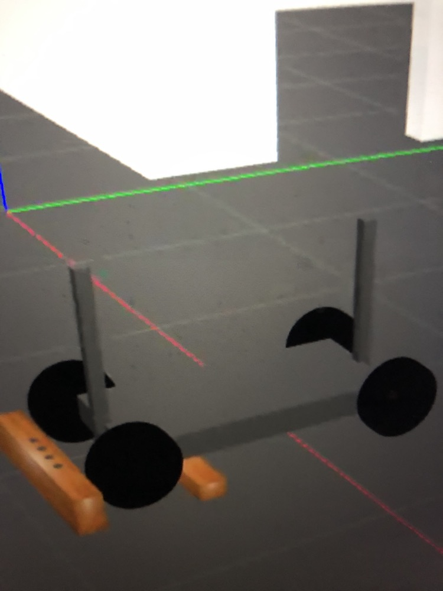

## Cart Demo 
In this demo, we intended to pick up a cube from a table, drop the cube on a cart, push the cart to a second table, and place the cube on the second table.

Here is the link to a video of our demo: https://youtu.be/yjCaiLlawmQ

We have documented our progress and unresolved issues below.

### Progress
* Modified an sdf file to create a handle on the cart_front_steer from the gazebo object collection
* Saved and loaded a personalized demo world into gazebo
* Programmed the robot to the table, pick up the cube, move to the cart, and drop the cube on the cart.
* Cart often rolled without external interaction, fixed this issue by adding two wooden planks as a way of increasing friction and resistance.

### Issues
* Robot often drops the cube just barely to the side of the cart
* Wooden boards have a lot of friction, robot may not be able to move the cart
* Pushing the cart is difficult! Robot arm trajectory is very different from how a human would move their arm.

### Future Work
* Increase the width of the chassis of the cart to allow of more room for error when dropping the cube
  * Have to adjust the inertia/size of the chassis and the position/joints of the wheels
* Lower constant of friction of the wooden boards
* Increase the height of rod on the cart to be better accessible to the robot
* Figure out how to push and interact with the cart
  * Figure out how to use perception to grasp the rod of the cart (like with the cube)
  * Figure out how to move the arm from a bent position to a fully extended position in a linear trajectory (simulating a pushing motion)
  * Try to push the cart with the base of the robot - you would have to figure out how to stop the robot from viewing the cart as an obstacle

